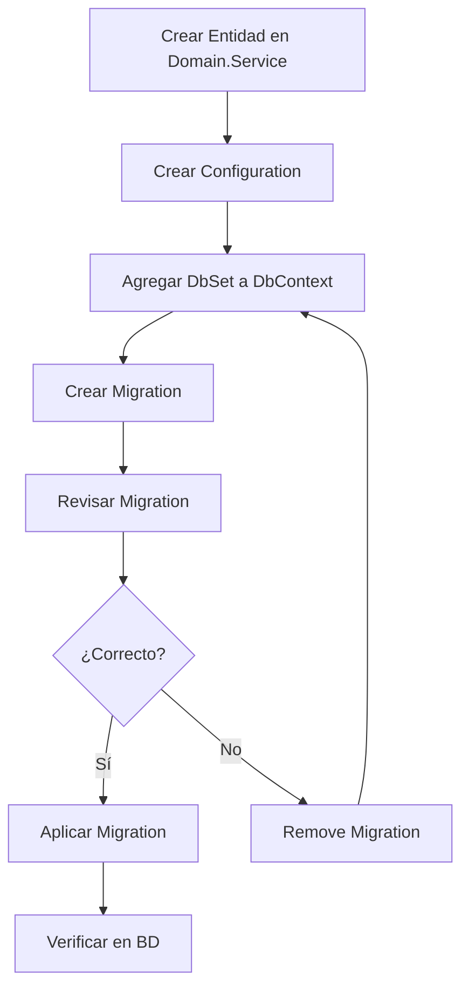

# Infrastructure.Entity

Esta capa contiene toda la lógica de acceso a datos usando **Entity Framework Core Code First** con **SQL Server**.

## 📋 Contenido

- [Inicio Rápido](#-inicio-rápido)
- [Estructura](#-estructura)
- [Características](#-características)
- [Documentación](#-documentación)
- [Flujo de Trabajo](#-flujo-de-trabajo)

## 🚀 Inicio Rápido

### Estado Actual
✅ Infraestructura Code First **completamente configurada**  
❌ Base de datos **no creada** aún  
❌ Migraciones **no creadas** aún  

### Crear tu Primera Entidad

**1. Entidad en Domain.Service:**
```csharp
// Domain.Service/Entities/Product.cs
public class Product : BaseEntity
{
	public string Name { get; set; } = string.Empty;
	public decimal Price { get; set; }
}
```

**2. Configuración en Infrastructure.Entity:**
```csharp
// Infrastructure.Entity/Configurations/ProductConfiguration.cs
public class ProductConfiguration : BaseEntityConfiguration<Product>
{
	public override void Configure(EntityTypeBuilder<Product> builder)
	{
		base.Configure(builder);
		builder.ToTable("Products");

		builder.Property(p => p.Name)
			.IsRequired()
			.HasMaxLength(DatabaseConstants.NameLength);

		builder.Property(p => p.Price)
			.HasPrecision(DatabaseConstants.DecimalPrecision, 
						 DatabaseConstants.DecimalScale);
	}
}
```

**3. DbSet en ApplicationDbContext:**
```csharp
// Infrastructure.Entity/Data/ApplicationDbContext.cs
public DbSet<Product> Products => Set<Product>();
```

**4. Crear y Aplicar Migración:**
```powershell
dotnet ef migrations add InitialCreate -p Infrastructure.Entity -s backend-ekos-pro
dotnet ef database update -p Infrastructure.Entity -s backend-ekos-pro
```

## 📁 Estructura

```
Infrastructure.Entity/
│
├── Configurations/              # Entity configurations
│   ├── BaseEntityConfiguration.cs
│   └── Examples/               # Reference examples
│
├── Constants/                   # Database constants
│   └── DatabaseConstants.cs
│
├── Data/                        # DbContext
│   └── ApplicationDbContext.cs
│
├── Extensions/                  # Extension methods
│   ├── DbContextExtensions.cs
│   └── ModelBuilderExtensions.cs
│
├── Helpers/                     # Utility helpers
│   └── DatabaseHelper.cs
│
├── DependencyInjection.cs       # DI registration
│
└── Documentation/
	├── GETTING_STARTED.md      📖 Quick start guide
	├── README_CODEFIRST.md     📖 Complete documentation
	└── MIGRATION_COMMANDS.md   📖 Command reference
```

## ✨ Características

### ApplicationDbContext
- ✅ Automatic audit field updates (CreatedAt, UpdatedAt, etc.)
- ✅ Auto-discovery of entity configurations
- ✅ Global conventions (DateTime precision, naming, cascade deletes)
- ✅ Debug logging enabled in development
- ✅ Audit field protection against modification

### BaseEntityConfiguration<TEntity>
- ✅ Reusable base for all entity configurations
- ✅ Automatic audit field configuration
- ✅ Pre-configured indexes
- ✅ Consistent entity setup

### DependencyInjection
- ✅ SQL Server configured
- ✅ Retry on failure (3 attempts, 30s max delay)
- ✅ Command timeout (60 seconds)
- ✅ NoTracking query behavior by default

### Extensions & Helpers
- ✅ DbContext utilities (DetachAll, IsTracked, etc.)
- ✅ ModelBuilder conventions
- ✅ Migration helpers
- ✅ Database lifecycle management

## 📖 Documentación

| Archivo | Descripción |
|---------|-------------|
| [`GETTING_STARTED.md`](GETTING_STARTED.md) | Guía de inicio rápido |
| [`README_CODEFIRST.md`](README_CODEFIRST.md) | Documentación completa de Code First |
| [`MIGRATION_COMMANDS.md`](MIGRATION_COMMANDS.md) | Referencia de comandos de migración |

## 🔄 Flujo de Trabajo

### Desarrollo Local



### Comandos Principales

```powershell
# Crear migración
dotnet ef migrations add <Nombre> -p Infrastructure.Entity -s backend-ekos-pro

# Aplicar migraciones
dotnet ef database update -p Infrastructure.Entity -s backend-ekos-pro

# Listar migraciones
dotnet ef migrations list -p Infrastructure.Entity -s backend-ekos-pro

# Eliminar última migración
dotnet ef migrations remove -p Infrastructure.Entity -s backend-ekos-pro
```

## 🎯 Reglas de Arquitectura

Según `copilot-instructions.md`:

### ✅ Hacer
- Usar Fluent API para configuraciones
- Crear `IEntityTypeConfiguration` para cada entidad
- Heredar de `BaseEntity` para todas las entidades
- Usar operaciones async para acceso a datos
- Mantener DbContext en Infrastructure.Entity

### ❌ No Hacer
- Usar DataAnnotations cuando Fluent API es suficiente
- Crear Generic Repository pattern
- Crear Unit Of Work pattern
- Acceder a DbContext directamente desde Controllers
- Crear abstracciones innecesarias

## 🔧 Configuración

### Connection String

`backend-ekos-pro/appsettings.Development.json`:
```json
{
  "ConnectionStrings": {
	"DefaultConnection": "Server=(localdb)\\mssqllocaldb;Database=EkosProDb_Dev;Trusted_Connection=true;MultipleActiveResultSets=true;TrustServerCertificate=true"
  }
}
```

### Registro en Program.cs

```csharp
// backend-ekos-pro/Program.cs
builder.Services.AddInfrastructureEntity(builder.Configuration);
```

## 📦 Paquetes NuGet

- `Microsoft.EntityFrameworkCore` (9.x)
- `Microsoft.EntityFrameworkCore.SqlServer` (9.x)
- `Microsoft.EntityFrameworkCore.Tools` (9.x)

## 🧪 Próximos Pasos

1. **Definir tus entidades de negocio** en `Domain.Service/Entities/`
2. **Crear configuraciones** en `Infrastructure.Entity/Configurations/`
3. **Agregar DbSets** al `ApplicationDbContext`
4. **Crear migración inicial** con `dotnet ef migrations add InitialCreate`
5. **Aplicar migración** con `dotnet ef database update`
6. **Verificar la base de datos** en SSMS o Azure Data Studio

## 💡 Tips

- Revisa los ejemplos en `Configurations/Examples/` para patterns comunes
- Usa `DatabaseConstants` para tamaños y precisiones consistentes
- Siempre revisa las migraciones generadas antes de aplicarlas
- Mantén nombres de migración descriptivos (e.g., `AddProductTable`, `UpdateUserEmail`)
- Todos los nombres deben estar en **inglés** (según copilot-instructions.md)

## 🔗 Links Relacionados

- [Documentación EF Core](https://learn.microsoft.com/en-us/ef/core/)
- [Code First Migrations](https://learn.microsoft.com/en-us/ef/core/managing-schemas/migrations/)
- [Fluent API](https://learn.microsoft.com/en-us/ef/core/modeling/)

---

**Estado**: ✅ Listo para crear entidades y migraciones  
**Última actualización**: 2025-01-19
